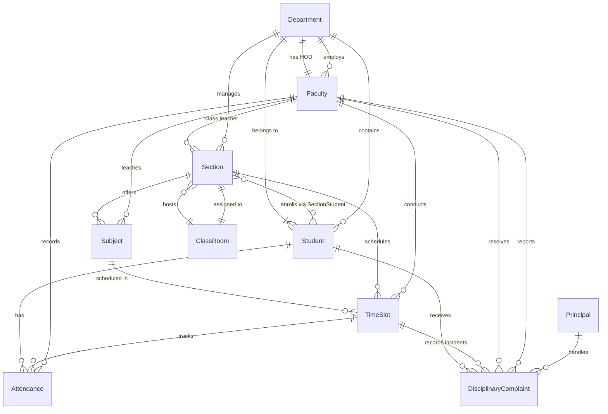

# Entity Relationship Diagram

This diagram shows the relationships between all models in the College Complaint Management System.

## Key Relationships

1. **Department Relationships**
   - Contains multiple Students
   - Employs multiple Faculty
   - Has one HOD (Faculty)
   - Manages multiple Sections

2. **Faculty Relationships**
   - Can be HOD of Department
   - Can be class teacher of Sections
   - Teaches Subjects
   - Records Attendance
   - Reports and resolves Complaints

3. **Section Relationships**
   - Assigned to one ClassRoom
   - Has multiple Subjects
   - Has multiple TimeSlots
   - Contains multiple Students (through SectionStudent)

4. **Student Relationships**
   - Belongs to one Department
   - Enrolled in Sections
   - Has Attendance records
   - Can receive Complaints

5. **TimeSlot Relationships**
   - Links Subject, Section, and Faculty
   - Tracks Attendance
   - Records Disciplinary incidents
