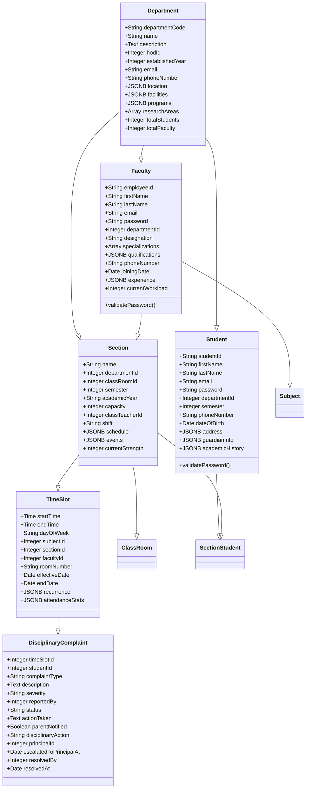

# Class Diagram

This diagram shows the detailed structure of each model including attributes and methods.

## Model Features

1. **PostgreSQL-Specific Types**
   - JSONB for complex data
   - Array for lists
   - TSVECTOR for search
   - Enum for constrained choices

2. **Common Attributes**
   - Timestamps (created_at, updated_at)
   - Soft deletes (deleted_at)
   - Search vectors
   - Metadata fields

3. **Security Features**
   - Password hashing
   - Email validation
   - Phone number validation
   - Status tracking
