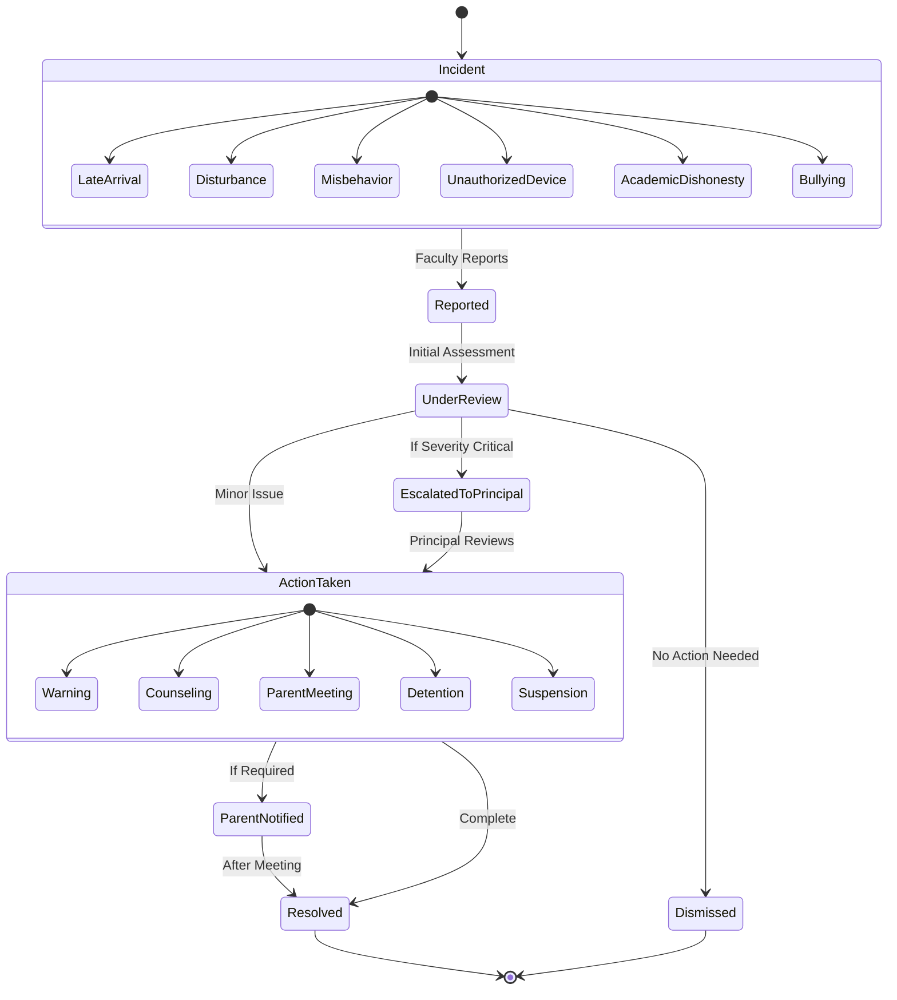

# Workflow Diagram

This diagram shows the disciplinary complaint workflow process.

## Workflow States

1. **Initial States**
   - Incident Occurs
   - Reported by Faculty
   - Under Review

2. **Processing States**
   - Escalated to Principal
   - Action Taken
   - Parent Notified

3. **Final States**
   - Resolved
   - Dismissed

4. **Incident Types**
   - Late Arrival
   - Disturbance
   - Misbehavior
   - Unauthorized Device
   - Academic Dishonesty
   - Bullying

5. **Action Types**
   - Warning
   - Counseling
   - Parent Meeting
   - Detention
   - Suspension
