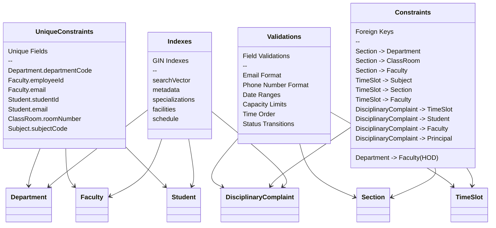

# Database Schema Diagram

This diagram shows the database schema including indexes and constraints.

## Database Features

1. **PostgreSQL-Specific Indexes**
   - GIN indexes for JSONB
   - GIN indexes for arrays
   - GIN indexes for full-text search
   - B-tree indexes for regular fields

2. **Constraints**
   - Foreign key relationships
   - Unique constraints
   - Not null constraints
   - Check constraints

3. **Validations**
   - Data format validations
   - Business rule validations
   - Cross-field validations
   - Status transition validations

4. **Performance Features**
   - Efficient indexing
   - Proper constraints
   - Optimized queries
   - Search vectors
